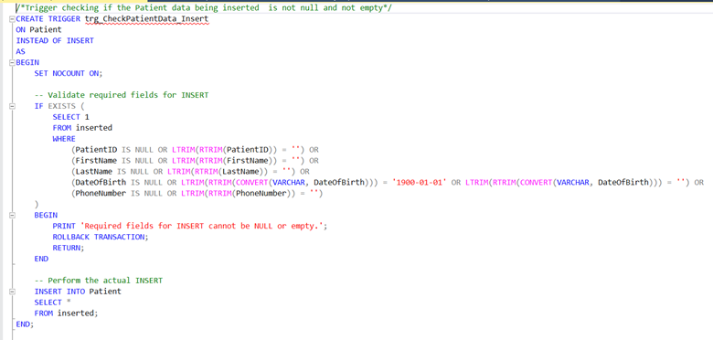
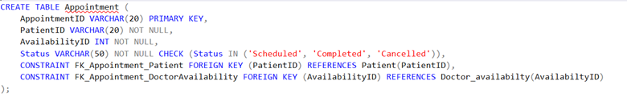
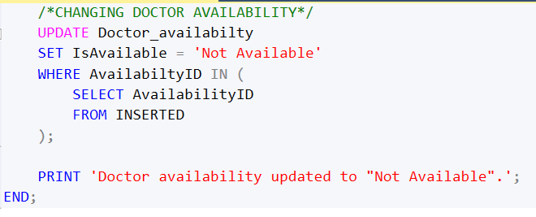
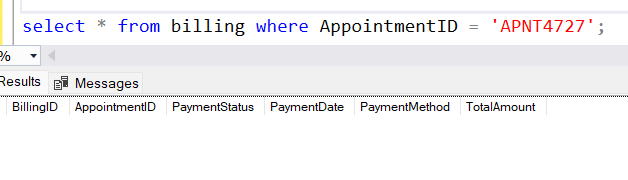
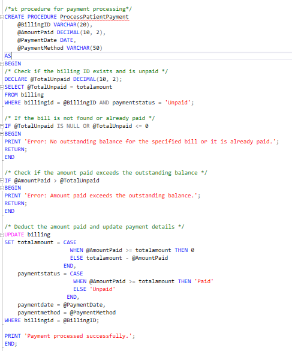
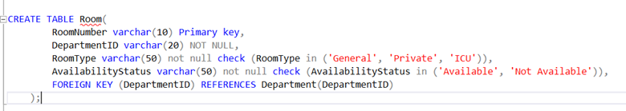
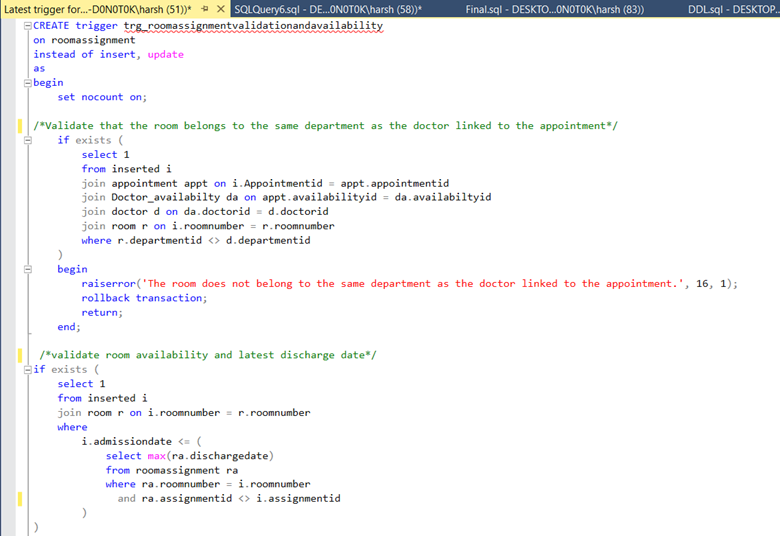
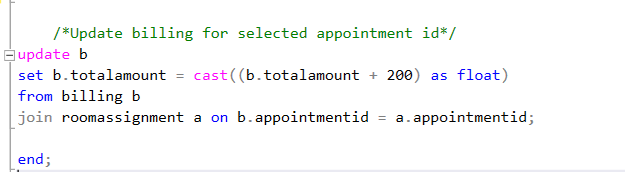

# Hospital Database System

## Overview

This project aims to design and implement a comprehensive hospital database system to manage healthcare operations efficiently. The database comprises 12 interconnected tables to handle information on patients, doctors, appointments, billing, medical records, prescriptions, rooms, and staff. Advanced techniques, such as normalization (up to 3NF), constraints, triggers, and stored procedures, were used to ensure data integrity and efficiency. Analytical queries and reports provide insights into revenue, patient trends, staff workload, and room occupancy, supporting effective hospital management. The data for this project was created synthetically using SQL to simulate real-world scenarios and ensure comprehensive testing of the database system.

## Features

1. **Data Integrity**  
   Ensuring data accuracy and consistency is paramount. The following measures were implemented:
   - **Normalization**: Applied up to Third Normal Form (3NF) to eliminate redundancy and improve data integrity.
   - **Constraints**: Enforced primary keys, foreign keys, and unique constraints to maintain data accuracy.
   - **Triggers**: Created triggers for automatic enforcement of business rules and consistency.
   - **Stored Procedures**: Developed procedures for routine operations to streamline tasks and maintain data integrity.
   - **Views**: Created views to simplify complex queries and provide consistent data representations.

2. **Interconnected Tables**  
   The database includes 12 interconnected tables to manage various aspects of hospital operations:
   - **Patients**: Stores patient information.
   - **Doctors**: Stores doctor information.
   - **Appointments**: Manages appointments between patients and doctors.
   - **Billing**: Handles billing details.
   - **Medical Records**: Maintains patient medical records.
   - **Prescriptions**: Tracks prescriptions issued to patients.
   - **Rooms**: Manages hospital room information.
   - **Staff**: Stores staff information.

3. **Analytical Insights**  
   The system provides various analytical queries and reports:
   - **Revenue Reports**: Analyze hospital revenue from billing data.
   - **Patient Trends**: Track patient trends over time.
   - **Staff Workload**: Monitor staff workload and efficiency.
   - **Room Occupancy**: Report on hospital room occupancy rates.

4. **PowerBI Dashboard**  
   An interactive PowerBI dashboard was created to visualize and analyze the hospital data effectively. The dashboard provides insights into key metrics such as:
   - Revenue and profit trends.
   - Patient demographics and trends.
   - Staff workload and performance.
   - Room occupancy rates.
   - Medical records and prescription trends.
  
## Methodology

### Tables
The database consists of 12 tables, designed to reduce data redundancy and increase data integrity. Most of the tables have been normalized to Third Normal Form (3NF), ensuring there are no partial or transitive dependencies. Each table has a well-defined primary key to maintain uniqueness and support efficient data management. Additionally, several constraints, such as foreign keys, unique constraints, and check constraints, have been applied to enforce data integrity and ensure consistent relationships between tables.

1. **Patient Table**: This table contains information about patient data.
     
   Here is a DDL (Data Definition Language) for the patient table showcasing the constraints for the other required columns.

   There has been a stored procedure created to simplify adding patients to the table.
   
   Example:  
    
   The stored procedure generates a unique patient ID every time a patient record is added using the stored procedure.

2. **Department Table**: This table contains information about different departments in the hospital with DepartmentID as the primary key.
   

3. **Doctor Table**: Contains information about doctors with DoctorID as the primary key and DepartmentID as the foreign key referencing the department table. This setup ensures that each doctor is associated with a specific department. For example, a doctor belonging to the radiology department will be considered a radiology specialist. This approach reduces data redundancy by maintaining department names in a single table.
   

4. **Doctor Availability Table**: This table stores information about doctor availability to effectively manage appointment bookings and cancellations. The Availability ID is the primary key, also referred to as the Slot ID, which helps track whether a specific slot for the doctor is available. The Is Available column indicates whether the slot is booked or still available.
   

   Example output for the table:
   

5. **Appointment Table**: This table tracks appointments booked for patients and includes the AvailabilityID from the Doctor Availability table. This helps to track appointments for each patient and provides information about the doctor the patient is meeting with. 
   

   - **PatientID Foreign Key Constraint**: Ensures that only existing patients can book appointments. Patient ID is not unique, allowing patients to book multiple appointments.
   - **AvailabilityID Constraint**: Not set to unique, allowing flexibility in rebooking canceled appointments. A trigger checks the availability of the slot in the Doctor Availability table before booking an appointment. If the slot is available, it changes the IsAvailable column to "Not Available" upon successful booking. If the appointment is canceled, the trigger updates IsAvailable back to "Available," allowing the slot to be reused.
   
   **Triggers for Appointment Booking**:
   
   
    
   Functionalities of the trigger:
   - Check if the slots being booked are available. If not, rollback to the previous state.
   - Ensure the date for the slot is not in the past. If it is, rollback.
   - Appointments can have three stages: Scheduled, Cancelled, and Completed. At the time of booking, the status can only be "Scheduled."
   - Automatically generate a bill with a fixed amount of $100 and set the status to "Unpaid."
   - Update the IsAvailable column to "Not Available" once the appointment is successfully booked.

   **Stored Procedure**:
   A stored procedure has been created for booking appointments, which generates an AppointmentID automatically.
 
   **Test Case**:
 
   Availability ID 6324 is not available. Attempting to book an appointment for this ID throws an error.

   Availability ID 6325 is available. Booking this slot for Patient ID P5 is successful, and the IsAvailable column is updated to "Not Available." The stored procedure generates a unique Appointment ID APNT4727, and a billing record is added.

   **Appointment Cancellation**:
    
   If the appointment is canceled, AvailabilityID 6325 is updated back to "Available," allowing future bookings. The billing record is deleted, ensuring data consistency and no redundant data.
   
   
6. **Billing Table**: This table tracks the billing information for the appointments booked.
   
   
   
   
   The Billing table has BillingID as the primary key. There is no "not null" constraint on the date and payment method because there can be unpaid bills in the database.
   
   Bills are tracked by appointments instead of patient ID to reduce complexity in the database. There can be both paid and unpaid bills for each patient. Since bills are generated with appointments, multiple joins would be needed to find the bills for each patient. To overcome this, a stored procedure has been created that retrieves all the bills for a patient present in the database.
   
   
   `EXEC PatientBills` retrieves the bills for the patient.
   
   Now, we have the bills for each patient. If the patient decides to pay the bill, a stored procedure can be used as shown below.
   
   
   Example:  
   
   
   This approach for the Billing table helps maintain data integrity and reduces data redundancy.

7. **Room Table**: This table contains information about room number, room type (General, ICU, Private), department ID to which the room belongs, and the availability status of the room.
   
   
   Room number is used as the primary key for the table, assuming that the room number for each room in the hospital is unique.

8. **RoomAssignment Table**: This table contains information about the room assignments for patients. AssignmentID is the primary key for the table.
   
   
   Room number is the foreign key but is not tied with a unique constraint as there can be future room assignment possibilities handled with triggers in the database.

   If it is decided during an appointment that the patient needs to be admitted, the RoomAssignment table needs to be used.

   Before inserting or updating RoomAssignment, multiple checks are performed using triggers to maintain data integrity and consistency across related tables.
   
   
   
   **Functionalities of the Trigger**:
   - Triggered at the time of insert and/or update.
   - Validates the department ID for the room and the doctor treating the patient (e.g., a doctor in Department 10 can only assign rooms belonging to Department 10).
   - Validates if the selected room number is available to be assigned.
   - Ensures the discharge date for the admission is greater than or equal to the admission date.
   - If the room is already assigned, it validates the discharge date for the current admission. If the new admission date is after the discharge date of the current room assignment, the record can still be added.
   - Checks that the Appointment ID used for the RoomAssignment does not belong to the same patient who is currently admitted (i.e., a patient cannot be admitted to multiple rooms at the same time).
   - If all checks pass, the RoomAssignment table is successfully updated or a new record is inserted.
   - Marks the room as not available in the room assignment table once successfully assigned.
   - Updates the billing record to maintain data consistency (e.g., if during Appointment ID 1 a doctor decides to admit the patient, $200 is added to the bill generated using Appointment ID 1).

   **Stored Procedure**:
   A stored procedure has been created to track RoomAssignment by Appointment ID, reducing the need for multiple joins. By entering the Appointment ID, the stored procedure retrieves available room numbers for the department.

   

   Some stored procedures are also created for Room Assignments.
   
   This stored procedure can be used for room assignments and automatically generates a unique AssignmentID.

10. **Staff Table**: This table contains information about the hospital staff.
   

11. **Medical Records Table**: Contains information about medical records for each appointment.

12. **Prescription Table**: Contains information about the prescriptions. It references RecordID from the Medical Records table and MedicineID from the Medicine table.
    

    There is a trigger set for appointment completion where once the appointment is marked complete, the billing table gets updated automatically and bills are marked paid to maintain data consistency. As this is synthetic data, triggers put random data. In real-world scenarios, these records need to be updated manually.

    Once the appointment is marked complete, it is assumed that the doctor has already provided the diagnosis, prescription, and treatment. The trigger will fill the Medical Records automatically for the appointment that is marked complete, ensuring data consistency in the database.
    

    Furthermore, once the Medical Records table is updated, the Prescription table gets populated as well.
    

    If a user wants to extract the information about the medical records for a specific patient, a stored procedure has been created for that.
    

    For this table, there are two temporary tables created which are not part of the database. These tables are used to randomly assign the records in the Medical Records table and Prescription table.
    

13. **Medicine Table**: This table contains information about the Medicine data, including stock quantity available in the hospital and medicine manufacturer information.
    

### Views
After creating all the tables, it can be challenging to read individual tables and extract meaningful information. To address this, views have been utilized to simplify data retrieval and provide a clearer narrative.

**View for Scheduled Appointments**:
   
   This view gives a detailed description of the scheduled appointments, showing data from multiple tables. It can be used for getting more information about the appointment details.

**View for Medical History**:
   
   This view gives a detailed and meaningful view of any medical record.

**View for Room Availability Dates**:
   
   This view enables the user to see the room availability, including the dates the room will be booked until.

## Conclusion
In this project, a comprehensive hospital database was designed and implemented to effectively manage real-world healthcare scenarios. The database consists of 12 well-structured tables with constraints to ensure data integrity, consistency, and validation. Triggers have been implemented to automate critical processes and maintain data quality, while stored procedures were developed to simplify frequent tasks, reducing the need for repetitive query writing. Overall, this database provides a robust, efficient, and scalable solution for hospital management, demonstrating the practical application of advanced database concepts to address real-world challenges.
